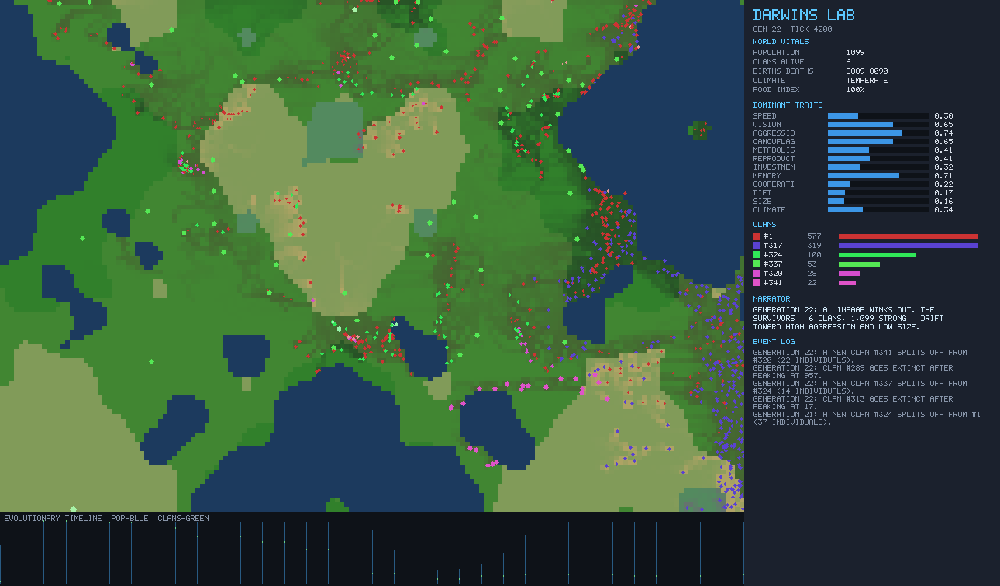

# 🧬 Darwin's Lab

A long-running **genetic-algorithm civilization lab**. Thousands of tiny
autonomous creatures evolve over thousands of generations inside a simulated
world with terrain, food, predators, weather cycles, disease, scarcity, and
migration pressure. You watch lineages mutate, branch into colored clans,
dominate, collapse, and adapt — and you can drop mass-extinction shocks on them.

The simulation is **plain deterministic code, no LLM**. An LLM only appears as
an *optional, batched, cheap* narrator after major events.



## What's interesting here

- **Emergent evolution you can see.** Each creature has a 12-gene genome
  (speed, vision, aggression, camouflage, metabolism, diet, size, …). Behaviour
  and physiology are derived from genes; selection does the rest. After an
  asteroid you can watch the survivors converge on tiny, high-camouflage,
  sharp-eyed builds — visible at a glance in the trait bars.
- **Real speciation.** Online genome-distance clustering splits the population
  into clans with a recorded lineage tree; clans occupy spatial niches on the
  map.
- **Long-running & observable.** Runs in a Web Worker, decoupled from
  rendering, with a downsampled ring-buffer history so you can scrub across the
  whole evolutionary timeline in bounded memory.
- **Deterministic.** One seeded PRNG drives everything — a seed reproduces an
  entire history exactly (covered by tests).
- **A real feedback loop in the repo.** A zero-dependency headless harness
  renders the world *and a full dashboard mock* to PNGs so balance/visual
  issues can be diagnosed without a browser. Most of the ecology tuning in the
  git history came from looking at those frames.

## Run it

```bash
npm install
npm run dev          # open the printed localhost URL
```

The world auto-runs. Use the speed buttons to push from a crawl to hundreds of
generations per minute. Click any creature to inspect its genome and ancestry.
Hit the **Mass Extinction** buttons to play god.

### Optional AI narrator (off by default, costs ~nothing)

```bash
# .env  (git-ignored)
ANTHROPIC_API_KEY=sk-ant-...    # or OPENAI_API_KEY=sk-...

npm run narrator     # tiny local endpoint, key stays server-side
```

Then toggle **AI** in the Narrator panel. It only calls the model *after a
major event* and *at most once per 25s* using the cheapest model with a ~90
token budget, so a long session costs a fraction of a cent. If the endpoint
isn't running it silently uses the free local heuristic narrator.

## Inspect / iterate (the dev feedback loop)

```bash
npm run inspect            # writes inspect/frame-*.png, inspect/dash-*.png, report.json
npm run inspect -- 30000 12 42   # ticks, frames, seed
npm run sim:headless       # quick vitals soak test
npm test                   # deterministic engine tests
```

`inspect/dash-*.png` is a full render of the product experience (map + sidebar
+ timeline) — open one to see exactly what the app shows at that moment.

## Architecture

```
src/sim/        deterministic engine (no DOM): rng, genome, world,
                simulation loop, speciation, shocks, stats, history
src/sim/worker  runs the engine off-thread, streams snapshots
src/store.ts    zustand store bridging worker ↔ React
src/render/     canvas world renderer + shared colour helpers
src/ui/         dashboard, inspector + ancestry, timeline, shocks, narrator
src/narrator/   free heuristic + optional LLM client
scripts/        headless inspection harness (PNG encoder, font, dashboard mock)
```

### Notes & trade-offs

- History is intentionally downsampled (counts + gene means, not positions) so
  the timeline scrubs across huge runs in bounded memory; scrubbing shows the
  macro charts, it does not re-animate past creature positions.
- Genealogy records are pruned once very large, so ancestry for extremely old
  creatures is bounded in depth.
- Population is capped for predictable performance; ecology keeps it well below
  the cap most of the time, so the cap is a safety ceiling, not the dynamic.
